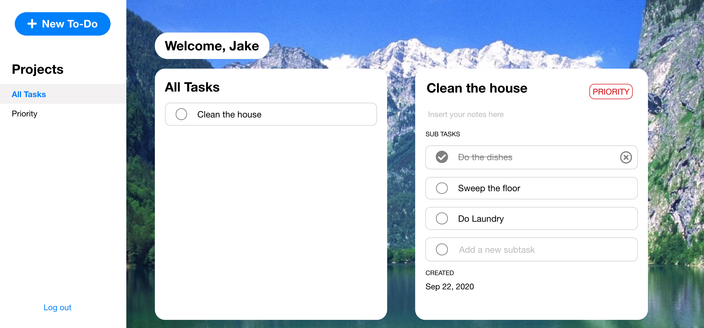

<h1 align="center">React To-Do List</h1>

<h2 align="center"><a  href="https://shielded-mesa-41166.herokuapp.com/">Live Demo</a></h2>

_You do not have to sign up/log in to use the demo._

## Description
To-Do List app implemented with React.js, MongoDB, and a Node.js/Express backend.

Front end design inspired by [any.do](any.do).

## Future Scope
Edit CSS for mobile display.